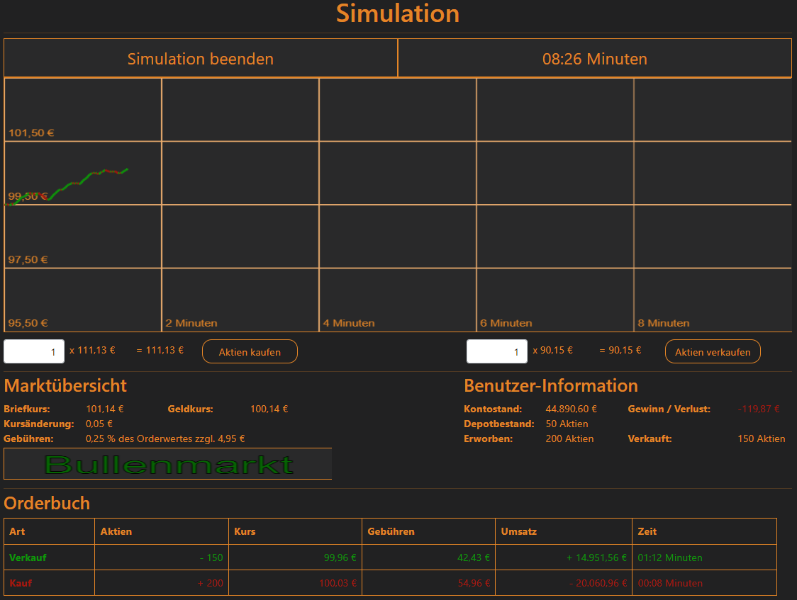

# Börsenspiel (Stock-Trading-Game)
**Prototyp eines webbasierten Serious Games zur Vermittlung von Grundlagen des Aktienhandels im Rahmen eines Uni-Projekts**


## Projektbeschreibung

Dieses Projekt ist ein interaktiver Frontend-Prototyp, der grundlegende Abläufe des Aktienhandels spielerisch vermittelt. Nutzerinnen und Nutzer durchlaufen zunächst eine Login- bzw. Registrierungsoberfläche und gelangen anschließend in eine Börsensimulation, in der Aktien innerhalb eines begrenzten Zeitraums gekauft und verkauft werden können.

Ziel des Projekts ist es, zentrale Konzepte wie Kursentwicklung, Gebühren, Depotbestand sowie Gewinn und Verlust anschaulich und praxisnah erfahrbar zu machen.

## Funktionen

- Login- und Registrierungsansicht
- Clientseitige Formularvalidierung mit Fehlermeldungen
- 10-minütige Börsensimulation
- Dynamische Kursentwicklung mit Bullen-/ und Bärenmarkt
- Kauf-/ und Verkaufslogik inklusive Gebührenberechnung
- Anzeige von Kontostand, Depotbestand und Ergebnis
- Visuelle Darstellung des Kursverlaufs per Canvas
- Orderbuch zur Protokollierung aller Transaktionen

## Technologien

- HTML5
- CSS3
- JavaScript
- jQuery
- Bootstrap
- Canvas API

## Projektstruktur

```text
.
|-- css/
|   `-- layout.css
|-- html/
|   |-- Login.html
|   |-- Register.html
|   `-- Simulation.html
|-- img/
|   `-- Logo.png
|-- js/
|   |-- signup.js
|   `-- simulation.js
`-- lib/
    |-- css/
    `-- js/
```

## Projekt starten

Da es sich um ein statisches Webprojekt ohne Build-Prozess handelt, ist keine Installation von Abhängigkeiten notwendig.

1. Repository klonen oder herunterladen
2. Die Datei `html/Login.html` im Browser öffnen

## Hinweise

- Es handelt sich um einen Prototyp und nicht um eine produktive Trading-Anwendung
- Es gibt keine echte Benutzerverwaltung oder persistente Datenspeicherung
- Es werden keine realen Börsendaten verwendet
- Die gesamte Logik läuft clientseitig im Browser

## Ziel des Serious Games

Das Börsenspiel soll einen niedrigschwelligen Einstieg in den Aktienhandel ermöglichen und insbesondere folgende Grundlagen vermitteln:

- Unterschied zwischen Kauf und Verkauf
- Einfluss von Kursänderungen auf den Depotwert
- Bedeutung von Transaktionskosten
- Zusammenhang zwischen Marktbewegung und Handelsergebnis

## Hinweis zur Dokumentation
Diese Dokumentation wurde teilweise mit Unterstützung von ChatGPT erstellt.  
Die Inhalte wurden anschließend geprüft, angepasst und an das Projekt angeglichen.
